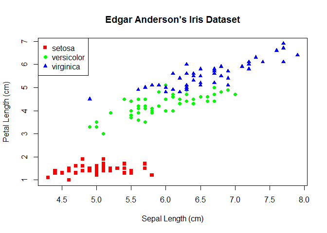
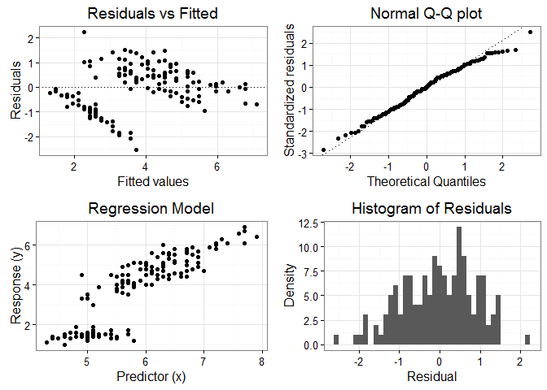

Bayesian linear regresssion (blm)
=================================

`blm` is a R package for fitting linear models in which the statistical analysis were undertaken within the context of Bayesian inference. The ingredients for a regression linear model include the response vector *y* = (*y*<sub>1</sub>, *y*<sub>2</sub>, *y*<sub>3</sub>, ..., *y*<sub>*n*</sub>) and a *n* x *p* design matrix (e.g. composed of explanatory variables) *X* = \[*x*<sub>1</sub>, *x*<sub>2</sub>, ..., *x*<sub>*p*</sub>\] assumed to have been observed without error. The linear regression model is composed by an intercept (*w*<sub>0</sub>), a slope (*w*<sub>1</sub>/*β*) and the error term:

*y*<sub>*i*</sub> = *w*<sub>0</sub> + *w*<sub>1</sub><sup>*T*</sup>*x*<sub>*i*</sub> + *ε*, where *ε*<sub>*i*</sub> is *N*(0, *σ*<sup>2</sup>).

The peculiarities of the Bayesian model compared to the frequentist model is that allow us to give our assumptions, or prior beliefs, about unknown parameters (w) by specifying the prior distribution over those parameters before seeing the data. The way we do it is by treating the weights (w) as random variables coming from a distribution we have partial knowledge about (*p*(*w*|*α*)=*N*(0, *α*<sup>−</sup>1*I*)). Once we observe the data we can compute the posterior probability distribution for the parameters, given the observed data (*p*(*w*|*x*, *y*)) and the hyper parameters *α* and *β*. (for a bit more details access [here.](https://github.com/izabelcavassim/blm/blob/master/Background.md%5D)

The posterior distribution can be lately used to:

1.  Modelling the relationship between x and y.
2.  Make predictions for new data points (by integrating over the posterior distribution, see update.blm).
3.  Account for uncertainty in the parameters values (see confint.blm).

The features of the package have some similarities to the [lm](https://stat.ethz.ch/R-manual/R-devel/library/stats/html/lm.html) R package. The blm package is just available through github and it is under development (version 0.1.0).

How to install
--------------

Open R and then follow the 3 next steps:

.1 You first need to install the devtools package through CRAN.

``` r
install.packages("devtools")
```

.2 Load the package just installed.

``` r
library("devtools")
```

.3 And then use the 'install\_github' feature to access the blm package

``` r
install_github("izabelcavassim/blm")
```

Functions associted with blm
----------------------------

### The blm model constructor

-   `blm()` Fits a model, given as a formula, optionally with data provided through the "..." parameter.It takes the model specification in the form of a formula as its parameter model and the prior precision alpha and the “precision” of the data beta. It then computes the mean and the covariance matrix for the model fitted to the data. **`make_prior()` Constructs a prior distribution for the weight vectors, which are Normally distributed: *N*(**0**,  **S**<sub>0</sub>) with **0**′=(0, 0) and **S**<sub>0</sub> = \[\[1/*α*, 0\],\[0, 1/*α*\]\]. And alpha is the hyperparameter or precision It returns a prior distribution, with a vector of means and a covariance matrix **`noresponse_matrix()` \*\*`update()`

### Other functions

-   `coef()` Returns the coefficients of the model of class blm().
-   `confint()` Returns the lower and upper confidence intervals of a parameter (parm) given. The usage of confint is as follow: `confint(object, parm, level = 0.95, ...)`. The parameter parm can be assigned with numbers (columns of the model data.frame) or names: 'y', 'x', 'z'... *`deviance()` It returns the deviance of a fitted blm model object. *`fitted()` Returns the fitted values extracted from the object model of class blm. *`plot()` Returns 4 grid arranged plots of the blm model object. The currently available plots are: 'Residuals vs Fitted values', 'Normal Q-Q plot' of standardized residuals', 'Regression Model' a plot of the first predictor and its response and a 'Histogram of Residuals' to observe the normality of the distribution. *`predict()` If additional data is provided, it gives the predicted values by evaluating the regression function. Otherwise, it gives the predictions based on the data used to fit the model. *`print()` It prints the called function and the coefficients of a blm model object. *`residuals()` It returns the model residuals (observed - predicted) from a blm object. \*`summary()` Returns a summary.blm object, which contains summary statistics and the following attributes: "data", "sys", "residuals", "coefficients", "significance", "SS\_total", "SS\_residuals", "R\_squared".

Example
-------

``` r
library(datasets)
data("iris")
attach(iris)
library(blm)

# There is a high correlation between Petal Lenght and Sepal Length
cor(iris$Petal.Length, iris$Sepal.Length)
```

    ## [1] 0.8717538

``` r
# Visualizing it
plot(Sepal.Length, Petal.Length, col=c("red", "green", "blue")[Species], pch=(15:17)[Species], main="Edgar Anderson's Iris Dataset", ylab = 'Petal Length (cm)', xlab = 'Sepal Length (cm)')
legend("topleft", legend=c(levels(iris$Species)), col=c("red", "green", "blue"), pch=c(15:17, -1, -1), lty=c(-1, -1, -1))
```



``` r
# We can model the relationship between Petal length and Sepal length
reg = blm(Petal.Length ~ Sepal.Length, alpha = 1, beta = 1.3)
class(reg)
```

    ## [1] "blm"

``` r
print(reg)
```

    ## 
    ## Call:
    ## blm(Petal.Length ~ Sepal.Length, alpha = 1, beta = 1.3)
    ## 
    ## Coefficients:

    ##      (Intercept) Sepal.Length
    ## [1,]   -5.570409     1.601308

``` r
(coef_reg = coefficients(reg))
```

    ##                   [,1]
    ## (Intercept)  -5.570409
    ## Sepal.Length  1.601308

``` r
summ_reg = summary(reg)
```

    ## 
    ## Call:
    ## blm(Petal.Length ~ Sepal.Length, alpha = 1, beta = 1.3)
    ## 
    ## Residuals:
    ##     Min.  1st Qu.   Median     Mean  3rd Qu.     Max. 
    ## -2.51700 -0.71100  0.02073 -0.02857  0.62200  2.22400 
    ## 
    ## Coefficients:
    ##                   [,1]
    ## (Intercept)  -5.570409
    ## Sepal.Length  1.601308
    ## 
    ## Coefficient Significance (0.05)
    ## "(Intercept)" "*"
    ## "Sepal.Length" "*"
    ## Adjusted R-squared: 0.5485091

``` r
attributes(summ_reg)
```

    ## $names
    ## [1] "data"         "sys"          "residuals"    "coefficients"
    ## [5] "significance" "SS_total"     "SS_residuals" "R_squared"

``` r
slope = coef_reg[2,1]
intercept = coef_reg[1,1]

# Plotting
plot(reg)
```



``` r
# Prediction of Petal Length given a new data
new_Sepal = data.frame(Sepal.Length = runif(100, min(Sepal.Length), max(Sepal.Length)))

predict_Plength = predict(reg, new_Sepal)
head(predict_Plength)
```

    ##        1        2        3        4        5        6 
    ## 5.021338 2.158418 1.404882 6.910904 1.396298 3.854103

Author(s)
---------

This package was created for the course 'Data Analysis and Software Development' held at Aarhus University under the guidance of Professor [Thomas Mailund](http://www.mailund.dk/index.php/about/).

References
----------

Introduction to Data Science and Statistical Programming in R (Thomas Mailund).
